# Guía de mantenimiento de la aplicación

En este documento se explican algunos detalles sobre su implementación, de cara a futuros mantenimientos.

## 0. Requisitos software

Para poder ejecutar esta aplicación se necesita un servidor Apache con una versión de PHP 5.4, y un servidor de base de datos MySQL donde importar la base de datos.

## 1. Estructura de la app

La estructura de carpetas y ficheros de la app es la siguiente:

**Carpetas**

* `ajax`: contiene, agrupados en carpetas, distintos ficheros PHP que se encargan de realizar distintas operaciones contra la base de datos (búsquedas, inserciones, etc) para cada categoría agrupada (profesores, departamentos, etc). Normalmente estas llamadas devuelven o bien datos en formato JSON para colocar en un formulario, o contenido HTML generado para volcar en una parte de una vista.
* `backup`: copias de seguridad útiles, como por ejemplo una copia vacía de la base de datos.
* `css`: ficheros CSS de la aplicación. El fichero `estilos.css` guarda estilos globales para toda la aplicación, mientras que el fichero `menu.css` los guarda específicamente para el menú desplegable izquierdo, el fichero `estilos_programaciones.css` los tiene para generar la vista con la programación didáctica (HTML), y `estilos_tiny` para el editor TinyMCE que se usa para editar las programaciones o las actas. Finalmente, el fichero `jquery-ui.min.css` contiene estilos propios de la librería jQuery-UI, empleada para algunos efectos, como arrastrar y soltar ciertos componentes.
* `docs`: manuales de uso para administradores y profesores, y también este manual de mantenimiento.
* `img`: imágenes que se usan en la aplicación, fundamentalmente iconos que aparecen en opciones de menú y formularios.
* `img_doc`: imágenes de capturas de pantalla para los manuales de usuario para administrador y profesores, y también para este documento de mantenimiento.
* `includes`: ficheros PHP que son incluidos desde otros, como la cabecera, el pie, la conexión a la BD, el menú izquierdo (incluido en la cabecera)...
* `js`: ficheros JavaScript con distintas funcionalidades según la opción cargada. Típicamente contienen funciones que emplean jQuery para obtener datos de la página, hacer llamadas asíncronas y cargar el contenido devuelto.
* `lib`: librerías externas JavaScript y PHP empleadas. En concreto, para JavaScript (subcarpeta *js*) se usa jQuery y algunas librerías derivadas. Para PHP (subcarpeta *php*) se emplea TCPDF para la generación de archivos PDF (versión de TCPDF compatible con PHP 5.4), PHPExcel para generación del Excel con las desideratas, y alguna auxiliar (FPDI para ayudar en la generación de PDF, o Parsedown para renderizar la ayuda escrita en formato Markdown).
* `modales`: formularios y ventanas modales incluidas desde distintas páginas para mostrar información a modo de *pop-up*.
* `pdf`: plantillas PDF que se usan para generar los PDF de desideratas con la elección de cada profesor.

**Ficheros de la carpeta principal**

El fichero principal de la aplicación es `index.php`, que básicamente carga cabecera y pie (que a su vez cargan los estilos CSS, menú, etc). Después existe un fichero por cada opción del menú. Por ejemplo el fichero `configuracion.php` carga la sección de *Configuración* del menú, el de `departamentos.php` la sección de *Departamentos* interna a *Profesores y Departamentos*, etc.

### 1.1. Respecto a Bootstrap

Actualmente la aplicación enlaza directamente con los ficheros online (CSS y JavaScript) de Bootstrap 5.

### 1.2. Otras consideraciones

En las siguientes secciones se van a ir desglosando las distintas tablas que forman parte de la base de datos, a medida que se expliquen los apartados de la aplicación. Se reflejarán en negrita las claves primarias de cada tabla, y en cursiva claves ajenas a otras tablas. Estas claves ajenas NO están implementadas en la base de datos en sí y se controla la integridad referencial mediante código.

Además, en la carpeta *backup* se dispone de un esquema entidad relación en formato *.vpd*, que se puede abrir con la herramienta [Visual Paradigm Online](https://online.visual-paradigm.com/es/). Existe tanto la versión antigua de la base de datos (Versión 1) como la nueva Versión 2.

En cuanto al código, se indicará en cada apartado qué ficheros están involucrados en la gestión de ese apartado en concreto. Dentro de cada fichero fuente hay comentarios que explican lo que hace cada parte del código.

## 2. Contenido común

El fichero `includes/cabecera.php` es incluido por todas las páginas principales de la aplicación (salvo el *login*) y carga una serie de archivos PHP, CSS y JavaScript comunes. Además de cargar Bootstrap, jQuery, jQueryUI y estilos asociados, también carga el menú izquierdo, unas ventanas modales comunes a varias partes de la aplicación (`modales/mensaje.php` y `modales/profesor.php`) y un fichero JavaScript `js/main.js` con funciones comunes usadas desde esos modales y otras partes del programa. También comprueba si el usuario logueado tiene permisos especiales (usuarios administradores o jefes de departamento), y guarda en sesión el departamento elegido por el usuario actual, si es que ha elegido alguno (en muchas páginas el usuario *admin* debe elegir con qué departamento quiere trabajar).

Por su parte, el fichero `includes/pie.php`, también incluido en todas las páginas (salvo *login*) dispone de un pequeño código JavaScript que se encarga de mostrar/ocultar el menú izquierdo cada vez que hacemos clic en el botón superior para el menú.

Además, los ficheros `includes/database.php` e `includes/database2.php` también son invocados desde todas las páginas PHP que accedan a la base de datos. El primero abre la conexión con los parámetros establecidos (servidor, usuario, contraseña) y el segundo la cierra al terminar.

### 2.1. El menú

El contenido del menú izquierdo se gestiona a través de los siguientes ficheros:

* `css/menu.css` contiene los aspectos CSS del menú
* `config.php` contiene un array PHP con las opciones que se despliegan. Dentro del propio fichero está la explicación de qué contiene cada registro del array
* En el fichero `menu.php` se hace uso del anterior para cargar y recorrer las opciones, mostrando las que sean compatibles con el usuario autenticado (según su rol).
* En el fichero `includes/cabecera.php` se incluye este `menu.php` para todas las páginas de la web

### 2.2. *Login* y *logout*

La página de `login.php` tiene una estructura distinta al resto, ya que no incluye la cabecera general. Simplemente define unos estilos básicos y carga el formulario de login. Este formulario se redirige a la propia página, que comprueba las credenciales del usuario y, si son correctas, guarda algunos datos en sesión y envía a la página de inicio `index.php`. 

Por su parte, la página de `logout.php`, invocada desde la opción *Salir* del menú, simplemente borra de sesión los datos guardados desde la anterior, y redirige al formulario de login.

#### 2.2.1. *Login* y usuarios activos

Sólo podrán hacer login en la aplicación el usuario administrador (*admin*, con la contraseña que se le haya establecido), y los profesores que estén actualmente activos (campo *activo* de la tabla *profesores* a uno).

## 3. Configuración

La página `configuracion.php`, que se activa desde la opción *Configuración* del menú izquierdo (sólo disponible para administradores) gestiona algunos aspectos generales de la aplicación, como son:

* Cambiar la contraseña del usuario administrador
* Activar/Desactivar la etapa para hacer las desideratas
* Activar/Desactivar la etapa para rellenar las programaciones didácticas

Internamente se apoya en el fichero `js/configuracion.js` para los botones de activación/desactivación. El resto de funcionalidad es interno a la propia página PHP, que se encarga directamente de hacer las operaciones contra la base de datos y recargar sus propios contenidos.

La tabla `config` de la base de datos es la que almacena esta información. Es una tabla aislada del resto, que simplemente guarda parejas de *clave-valor* con cada parámetro de configuración (contraseña de administrador, activación/desactivación de desideratas, etc).

   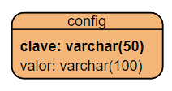

## 4. Departamentos, especialidades y profesores

La opción *Profesores y Departamentos* del menú, también disponible sólo para administradores, se ocupa de dar de alta/baja los distintos departamentos del centro, las especialidades adscritas a él y los profesores que pertenecen a cada departamento, dentro de cada especialidad. Estas tres tablas están relacionadas como sigue (en negrita se reflejan las claves primarias y en cursiva las claves ajenas):

   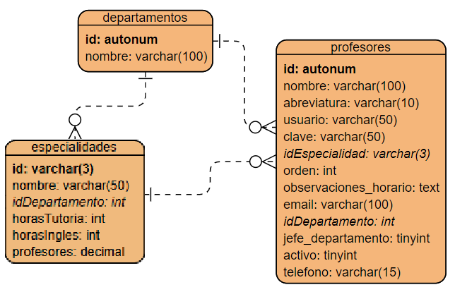

* Una especialidad corresponde a un departamento (existe una clave ajena en la tabla *especialidades* que indica el departamento al que pertenecen)
* Un profesor corresponde a un departamento y tiene una especialidad (en la tabla *profesores* existe una clave ajena a cada una de las otras dos tablas, para indicar el departamento y especialidad asignados).

### 4.1. Departamentos

En cuanto a los departamentos, el fichero `departamentos.php` es la vista principal desde la que se gestionan. Incluye estos ficheros (además de *cabecera.php* y *pie.php*, incluidos en todas las vistas principales):

 * `modales/departamentos.php`: formulario modal que se abre para crear/editar departamentos.
 * `js/departamentos.js`: código JavaScript que se utiliza para, mediante jQuery y AJAX, hacer llamadas para listar departamentos, guardarlos, borrarlos... recoger los resultados y mostrarlos en la vista
  
Además, desde el fichero JavaScript se hacen llamadas por AJAX (usando jQuery) a los siguientes ficheros PHP para recuperar información:

 * `ajax/departamentos/cargar_departamentos.php`: devuelve el HTML de listado de todos los departamentos
 * `ajax/departamentos/cargar_departamento.php`: recibe como parámetro un *id* de departamento y devuelve su información detallada en formato JSON, para el formulario de edición
 * `ajax/departamentos/borrar_departamento.php`: recibe como parámetro un *id* de departamento y lo borra de la base de datos (si cumple los requisitos necesarios)
 * `ajax/departamentos/insertar_departamento.php`: recibe por POST los datos de un departamento y lo añade/modifica en la base de datos.

### 4.2. Especialidades

Las especialidades se gestionan desde la página `especialidades.php`, que a su vez incluye estos ficheros (además de *cabecera.php* y *pie.php*, incluidos en todas las vistas principales):

* `modales/especialidades.php`: formulario modal para crear/editar especialidades
* `js/especialidades.js`: código JavaScript para pedir listados, inserciones, borrados, etc de especialidades a través de llamadas AJAX.

Los ficheros a los que se hacen llamadas AJAX desde el fichero JavaScript anterior son:

* `ajax/especialidades/cargar_especialidades.php`: devuelve el HTML de listado de las especialidades del departamento que se indique
* `ajax/especialidades/cargar_especialidad.php`: devuelve los datos de una especialidad en formato JSON para cargarlos en el formulario.
* `ajax/especialidades/borrar_especialidad.php`: recibe como parámetro un *id* de especialidad y la borra de la base de datos
* `ajax/especialidades/insertar_especialidad.php`: recibe los datos de una especialidad y la añade/modifica en la base de datos

### 4.3. Profesores

Los profesores se gestionan desde la vista principal `profesores.php`, similar a la anterior de especialidades en cuanto a estructura general. Internamente utiliza estos ficheros:

* `modales/profesores.php`: formulario modal para la creación/edición de profesores. Este formulario modal también se invoca desde la opción *Perfil* del menú izquierdo, y sirve en ambos casos para editar datos del profesor seleccionado.
* `js/profesores.js`: código JavaScript para gestión de profesores, con funciones que usan jQuery y AJAX para listar, borrar, insertar... profesores

Los ficheros AJAX a los que se accede desde este fichero JavaScript son:

* `ajax/profesores/cargar_profesores.php`: devuelve el HTML de listado de profesores del departamento seleccionado.
* `ajax/profesores/cargar_profesor.php`: devuelve los datos de un profesor en formato JSON para cargarlos en el formulario
* `ajax/profesores/borrar_profesor.php`: recibe como parámetro un "id" de profesor y lo borra de la base de datos, junto con los vínculos que tenga (selección de materias, preferencias horarias...)
* `ajax/profesores/insertar_profesor.php`: recibe los datos de un profesor para insertar/actualizar en la base de datos.
* `ajax/profesores/actualizar_jefe_departamento.php`: recibe un id de profesor y de departamento y establece a ese profesor como jefe de ese departamento (quitando al resto que hubiera)
* `ajax/profesores/actualizar_profesor_activo.php`: activa/desactiva al profesor que se le indique. Los profesores no activos no pueden interactuar con el sistema, pero forman parte de la base de datos para consultas de histórico, o posibles vueltas en el futuro.
* `ajax/profesores/ordenar_profesores.php`: a este archivo se le invoca cada vez que hay un evento de *drag&drop* en el listado de profesores, para reordenar la lista y establecer así el orden en que se asignarían las materias en una hipotética "rueda" de selección. El evento está especificado en el fichero `js/profesores.js`, que envía al PHP un string con los "id" de los profesores en el orden deseado, para que el PHP lo procese y vaya actualizando el campo *orden* de cada profesor
* `ajax/especialidades/cargar_especialidades_json.php`: aunque está ubicado en el módulo de especialidades, se utiliza este archivo desde la función `cargarPerfil` de `js/main.js` y desde la función `nuevoProfesor` de `js/profesor.js`, para obtener en formato JSON los datos de las especialidades del departamento al que pertenece el profesor, y con ellas rellenar la lista desplegable del formulario de perfil del profesor para elegir asignarle especialidad.

#### 4.3.1. Más sobre la gestión de preferencias horarias

Para la gestión de preferencias horarias entran en juego dos tablas más: una es la tabla de `horas`, que guarda todos los turnos horarios del centro. Esta tabla debe editarse a mano en la base de datos porque no existe página para ello en la aplicación. Tiene como clave primaria la hora de inicio de cada franja, y un segundo atributo que indica si es un turno de mañana (M) o tarde (T).

Por otra parte está la tabla `preferencias_horario`, que guarda, para cada profesor (identificado por su *id*), qué horas de la tabla anterior prefiere no tener clase, en dos categorías:

* Horas categorizadas como "rojas" (R) o de alta preferencia (el profesor no quiere estar esas horas en clase)
* Horas categorizadas como "amarillas" (A) o de preferencia media (el profesor preferiría no estar en esas horas, pero no son tan relevantes como las anteriores).

También se guarda el día de cada preferencia (de L a V).

   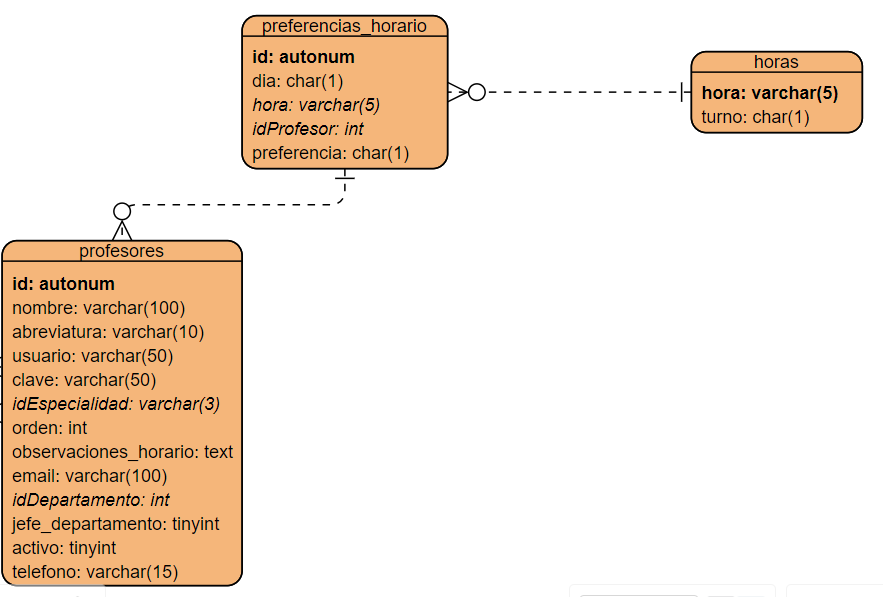

Los ficheros involucrados en la gestión de preferencias horarias son los siguientes:

* En el formulario modal `modales/profesor.php` hay un apartado identificado como *prefhoras* donde se vuelca una tabla con el horario semanal y las preferencias actuales del profesor (salvo en el caso de que estemos insertando un nuevo profesor, en cuyo caso no se muestra esta tabla hasta que ya esté registrado).
* La tabla anterior se vuelca al invocar a la función `cargarPerfil` del fichero `js/main.js`. Esta función carga los datos del profesor seleccionado, y las preferencias las actualiza invocando a la siguiente página PHP...
* `ajax/profesores/cargar_preferencias_profesor.php`: recibe como parámetro el *id* de un profesor y busca sus preferencias horarias en la tabla `preferencias_horario`. Vuelca la tabla generada con las casillas coloreadas y el código JavaScript necesario para cambiar de color las casillas al hacer clic en ellas y elegir así nuevas preferencias.
* El fichero anterior hace uso de la función `preferencia` del fichero `js/main.js`. Esta función recibe la preferencia horaria codificada de una forma específica que ahora explicaremos, y el tipo de preferencia (roja o amarilla), y añade esa preferencia al formulario de perfil del profesor.

**Codificación de las preferencias**

Cada preferencia se guarda de forma individual en la tabla `preferencias_horario` con su día, hora, profesor y tipo de preferencia (roja 'R' o amarilla 'A'). Pero, a la hora de irlas acumulando en el formulario de profesor `modales/profesor.php` dentro de los campos *hidden* llamados *prefRojas* y *prefAmarillas*, se almacenan con un formato específico para luego enviarlo al servidor: cada casilla que el usuario elige se almacena en el campo correspondiente (rojas o amarillas) indicando la letra del día (L a V) y la hora, sustituyendo los dos puntos por un subrayado. 

Por ejemplo, si el usuario elige en rojo el lunes a las 07:55 y el miércoles a las 11:00, el campo *prefRojas* almacenará la cadena *L07_55X11_00*. Luego en el servidor esta secuencia se trocea y procesa (fichero `ajax/profesores/insertar_profesor`), para insertar cada preferencia.

#### 4.3.2. El perfil del profesor logueado

El apartado *Perfil* del menú invoca también a la función `cargarPerfil` comentada antes, para editar los datos del profesor del mismo modo que se ha venido explicando para la sección de *Profesores*.

## 5. Actas de departamento

Las actas de departamento se almacenan en una tabla `actas_departamentos`, relacionada con la tabla `departamentos` a partir del *id* del departamento al que pertenece el acta. Internamente tiene campos para indicar la fecha de la reunión y el contenido (texto) de la misma.

   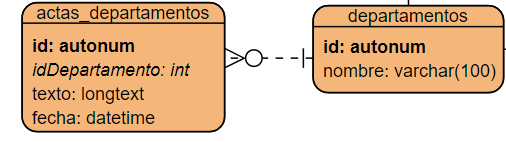

La gestión principal se realiza desde el fichero `actas.php` que, internamente (además de incluir la cabecera y pie como otras vistas principales) hace uso de los siguientes ficheros:

* `includes/seleccion_departamento.php`: sólo para el caso de administradores, se muestra un desplegable para que elijan de qué departamento quieren gestionar las actas. Al elegir un departamento de la lista se activa una función JavaScript `seleccionarDepartamento`, disponible en el siguiente fichero, para elegir el departamento y recargar la página con sus datos.
* `js/actas.js`: dispone de funciones JavaScript para cargar listados de actas de un departamento, contenido de un acta concreta, enviar para insertar/modificar actas, etc.
* `lib/js/tinymce`: se incluyen un par de ficheros relacionados con el editor TinyMCE, un editor WYSIWYG (*What You See Is What You Get*) para editar el contenido de las actas.

Es importante recalcar que parte de estas funcionalidades sólo están disponibles para administradores o jefes de departamento, que pueden crear y editar actas. Los roles de "profesor" normal sólo pueden consultar las fechas de las distintas actas y generar un PDF de las mismas.

Además, desde el fichero JavaScript anterior se utilizan los siguientes ficheros PHP en las llamadas AJAX:

* `ajax/actas/cargar_actas_departamento.php`: devuelve un listado de opciones de formulario con las fechas y los *id* de las actas del departamento actual (almacenado en sesión)
* `ajax/actas/cargar_contenido_acta.php`: devuelve el contenido (campo *texto* de la BD) del acta indicada. Se vuelca directamente como respuesta, y desde JavaScript se ubica en el editor TinyMCE
* `ajax/actas/cargar_fecha_acta.php`: devuelve la fecha del acta indicada. Se vuelca directamente la fecha formateada como respuesta, y su valor se ubica en el campo *fecha* del formulario del acta.
* `ajax/actas/insertar_acta_departamento.php`: recibe por POST los datos de un acta y con ellos crea una nueva (si no se recibe el *id* del acta) o modifica el acta cuyo *id* se especifique.
* `ajax/actas/nueva_acta_departamento`: se invoca cuando se quiere crear un nuevo acta, y lo que hace es generar un contenido inicial predefinido (listado de profesores del departamento asistentes y alguna cosa más).

## 6. Cursos, grupos y materias

Explicamos a continuación cómo se hace la gestión de los distintos cursos, grupos de cada curso y materias de cada curso.

### 6.1. Cursos

Los cursos se gestionan en una tabla `cursos`, que tiene los datos elementales del curso: nombre y abreviatura para los listados. Adicionalmente también se guarda el número de horas a la semana que tiene de clase, y la categoría de curso que es (ESO, BACH o FP actualmente). También se almacena el orden que tiene en el listado de cursos de la aplicación, ya que el administrador puede reordenarlos arrastrando y soltando.

   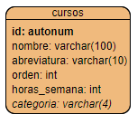

La gestión de cursos se coordina desde la vista principal `cursos.php`, que carga cabecera y pie generales y hace uso de estos ficheros:

* `modales/cursos.php`: formulario modal que se invoca desde la vista anterior para crear/editar cursos.
* `js/cursos.js`: código JavaScript para gestionar mediante AJAX la carga, borrado o edición de cursos.

Adicionalmente, el fichero JavaScript anterior se apoya en estos ficheros para sus llamadas por AJAX:

* `ajax/cursos/cargar_curso.php`: devuelve en formato JSON los datos del curso indicado (para ponerlo en el formulario de edición)
* `ajax/cursos/cargar_cursos.php`: devuelve un listado de cursos en formato HTML para cargalos en la vista principal de cursos (dentro de un "div" preparado para ello)
* `ajax/cursos/insertar_curso.php`: inserta/actualiza el curso que recibe por POST
* `ajax/cursos/borrar_curso.php`: elimina el curso indicado, siempre que no tenga otras dependencias (materias y/o grupos ya asociados)
* `ajax/cursos/ordenar_cursos.php`: cambia el orden de los cursos según el que haya establecido el administrador arrastrando y soltando los cursos en la lista

### 6.2. Grupos

La tabla `grupos` de la base de datos hace referencia a los distintos grupos asignados a cada curso. Por ejemplo, se puede tener un curso para el ciclo de FP de 1º DAM, y los grupos A y B asignados a ese curso. Así, esta tabla queda vinculada con la tabla de cursos anterior, para saber a qué curso corresponde el grupo:

   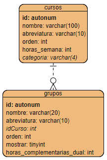

Como vemos, cada grupo tiene un nombre completo, una abreviatura, la referencia al curso al que pertenece, un orden interno entre los grupos de un curso, un booleano *mostrar* que indica si mostrar la información del grupo en los listados (esto convendrá o no dependiendo del curso en sí) y el número de horas semanales que tiene asignadas por reducción en el caso de impartir FP dual (es posible que este campo deje de utilizarse en un futuro y se pueda eliminar).

La gestión de grupos se centraliza en la vista principal `grupos.php`, que carga cabecera y pie comunes de la aplicación y hace uso de estos otros archivos:

* `modales/grupos.php`: formulario para alta/edición de grupos
* `js/grupos.js`: funciones JavaScript para hacer peticiones AJAX de listado de grupos, inserciones, borrados, etc.

Los ficheros AJAX que se utilizan desde esta sección son:

* `ajax/grupos/cargar_grupos.php`: devuelve un listado HTML con los grupos encontrados para el curso actualmente seleccionado. Se muestran en la zona habilitada para ello en la vista principal de grupos.
* `ajax/grupos/cargar_grupo.php`: devuelve en formato JSON los datos del grupo indicado, para cargarlos en el formulario modal y poderlos editar.
* `ajax/grupos/insertar_grupo.php`: recibe por POST los datos de un grupo, para insertarlo o modificarlo.
* `ajax/grupos/borrar_grupo.php`: elimina el grupo indicado de la base de datos
* `ajax/grupos/ordenar_grupos.php`: ordena los grupos recibidos en la base de datos, asignándole a cada uno un número de orden correlativo. Esta ordenación es particular para cada curso, es decir, los grupos de un curso se numerarán con el orden 1, 2, 3... y los de otro curso diferente con otro orden paralelo 1, 2, 3...

### 6.3. Materias

Las materias de cada curso se almacenan en la tabla `materias` de la base de datos, vinculada a la de `cursos` por la clave ajena. Además, las materias corresponden a un departamento y se asignan (o pueden asignarse) a profesores de una determinada especialidad.

   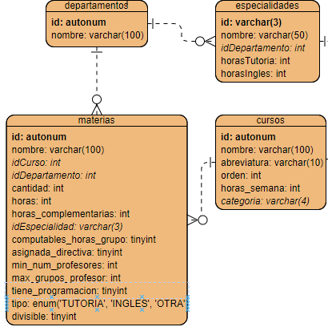

En cuanto a la información que se almacena de cada materia, además de su *id* autonumérico: nombre de la materia, curso al que pertenece (clave ajena a *cursos*), departamento al que pertenece (clave ajena a *departamentos*), cantidad de unidades ofertadas por grupo (por ejemplo, si hay desdobles), horas semanales, horas complementarias semanales, especialidad que la puede impartir (clave ajena a *especialidades*, o NULL si no hay restricción explícita), si es computable para las horas semanales lectivas del grupo (normalmente sí, salvo algunas tutorías, por ejemplo), si es una materia que el profesorado puede elegir libremente o la asigna la directiva (por ejemplo, tutorías u otros cargos), el mínimo número de profesores que se requiere para impartir la materia (porque haya grupos simultáneos), y cuántos grupos como máximo puede coger un profesor (porque se den en horarios compatibles). También indicamos si la materia tiene programación didáctica asociada (por ejemplo, las tutorías no tienen), y el tipo de materia que es (tutoría, inglés u otra general). Finalmente, se indica si es una materia divisible (es decir, cuyas horas semanales puedan repartirse entre más de un profesor).

La gestión de materias se coordina desde la vista principal `materias.php`. Carga cabecera y pie comunes de la aplicación y utiliza estos otros ficheros:

* `modales/materias.php`: formulario modal para insertar/modificar materias
* `js/materias.js`: funciones JavaScript para hacer llamadas AJAX con que listar, insertar o borrar materias.

Este fichero JavaScript hace uso de los siguientes módulos a través de AJAX (jQuery):

* `ajax/materias/cargar_materias.php`: devuelve un listado HTML con las materias de un curso indicado, para colocar en un "div" específico de la página.
* `ajax/materias/cargar_materia.php`: devuelve en formato JSON los datos de la materia seleccionada, para cargarlos en el formulario modal y poderlos modificar.
* `ajax/materias/insertar_materia.php`: inserta/modifica una materia en la base de datos
* `ajax/materias/borrar_materia.php`: elimina de la base de datos la materia indicada, y las selecciones que hayan hecho de ella los profesores.

> **ACTUALIZACIÓN**: con posterioridad, se añadieron cuatro campos más a la tabla de `materias`:
> * `codigo_oficial`: código oficial de la materia en el listado de módulos del ministerio
> * `nombre_oficial`: nombre oficial de la materia
> * `creditos_ects`: créditos ECTS de la materia
> * `horas_anuales`: horas totales al año de la materia

#### 6.3.1. Configuración específica por grupo

Como ciertos grupos de ciertos cursos pueden tener una configuración especial, la tabla `materias_grupos` permite definir las características de cada materia para cada grupo. Por ejemplo, es posible que en unos grupos las horas de tutoría sean más que en otras, o que haya grupos de desdoble y en otros grupos no...

   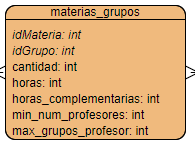

Se tiene un formulario modal `modales/materias_grupos.php` para editar la información de cada materia para cada grupo, y dos ficheros que se invocan por AJAX:

* `ajax/materias/cargar_forms_materias_grupos.php`: rellena el contenido de la ventana modal con un formulario para cada grupo, para editar la información relativa a esa materia y grupo. A este PHP se le invoca desde la función `cargarMateriasGrupos` del fichero JavaScript anterior, cada vez que se elija editar esta opción para una materia concreta.
* `ajax/materias/insertar_materia_grupo.php`: inserta un nuevo registro en la tabla. Se le llama al enviar cada uno de los formularios de la ventana modal anterior.

Además, se ha añadido código en las páginas `ajax/materias/insertar_materia.php`, `ajax/materias/borrar_materia.php`, `ajax/grupos/insertar_grupo.php` y `ajax/grupos/borrar_grupo.php` para que automáticamente se propague la inserción o el borrado a todos los grupos afectados en la tabla `materias_grupos`. 

#### 6.3.2. Asociación de competencias con materias

Dado que se pueden asociar competencias profesionales específicas a materias, se tiene la tabla `competencias_materias` que relaciona el id de cada materia con el id de la competencia (tabla `competencias_ciclos`) en cuestión.

   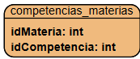

Desde la vista de `materias.php` se carga el modal `modales/competencias_materia.php`. En el fichero `js/materias.js` se tienen funciones para cargar las competencias asociadas a la materia en el modal, y también para borrar o añadir competencias. Estas funcionalidades se apoyan en los siguientes ficheros AJAX:

* `ajax/materias/cargar_competencias_materia.php`: carga las competencias actualmente asociadas a una materia, junto con un botón para borrar cada una y un formulario para añadir nuevas.
* `ajax/materias/borrar_competencia_materia.php`: borrar la competencia indicada de la materia indicada.
* `ajax/materias/nueva_competencia_materia.php`: añade la competencia indicada a la materia indicada.

### 6.4. Ciclos

Para aquellos cursos que correspondan a ciclos formativos, se ha definido una tabla `ciclos` con la siguiente información:

    

Además del *id* autonumérico del ciclo guardamos su nombre, a qué familia profesional pertenece y el nivel (grado básico, medio, superior...).

La gestión de ciclos se coordina desde la vista principal `ciclos.php`, con una estructura y funcionamiento análogos a los cursos, pero con los campos propios de los ciclos. También se tiene el correspondiente formulario modal en `modales/ciclos.php`, y el código JavaScript en `js/ciclos.js`, junto con las llamadas AJAX en la subcarpeta `ajax/ciclos`.

#### 6.4.1. Asociación de cursos con ciclos

Los ciclos se componen de varios cursos, de modo que se añade la tabla `cursos_ciclos` para indicar cada curso a qué ciclo(s) pertenece (ya que un mismo curso podría asociarse a varios ciclos, pensando en programas de flexibilización como DAM-DAW).

    

La asociación de los cursos que pertenecen a cada ciclo se hace desde la vista de `ciclos.php`, a través del formulario modal `modales/cursos_ciclos.php`. En el fichero `js/ciclos.js` se añaden las funciones correspondientes para cargar el modal y realizar por AJAX las operaciones importantes (borrar/actualizar/insertar asociaciones entre cursos y ciclos), que se apoyan en estos ficheros PHP:

* `ajax/ciclos/cargar_asociaciones_cursos.php`: carga en el modal todas las asociaciones de cursos con el ciclo seleccionado, junto con botones para borrarlas/actualizarlas y un formulario para dar nuevas de alta.
* `ajax/ciclos/borrar_curso_ciclo.php`: elimina la asociación de un curso con un ciclo
* `ajax/ciclos/actualizar_curso_ciclo.php`: actualiza los datos de la asociación de un curso con un ciclo (como el orden que ocupa el curso en el ciclo).
* `ajax/ciclos/insertar_curso_ciclo.php`: añade un nuevo curso al ciclo, en el orden indicado.

## 7. Desideratas y selección de materias

En este apartado veremos cómo gestionar la selección de materias en distintos cursos. Para ello nos basaremos en lo que llamamos *escenarios*, que permiten crear áreas de trabajo diferentes para cada curso académico y para cada grupo de departamentos afectados. Podemos consultar en todo momento el histórico de selecciones en cada escenario en cursos pasados, y también crear nuevos para futuros cursos.

### 7.1. Los escenarios

Para definir escenarios de desideratas hacemos uso de dos tablas: la tabla `escenarios_desideratas` permite crear el escenario en sí y asignarle un nombre. Después, en la tabla `departamentos_escenarios` asociamos qué departamentos se asignan a un escenario para que elijan materias bajo dicho escenario.

   

Para cada escenario, se almacena en dos campos booleanos (*tinyint*) si es el escenario actual (el que se usa para trabajar en el presente curso) y si está activo para desideratas (es decir, si se pueden elegir materias sobre él o ya se ha cerrado).

La gestión de escenarios se realiza desde la vista principal `escenarios.php`. Internamente carga cabecera y pie comunes de la web y hace uso de estos ficheros:

* `includes/seleccion_departamento.php`: en el caso de acceder como usuario *admin*, este *include* permite elegir el departamento con el que trabajar, como paso previo a la gestión de escenarios para ese departamento.
* `modales/escenarios.php`: formulario modal para crear/modificar escenarios
* `js/escenarios.js`: funciones JavaScript para cargar, insertar, borrar... escenarios a través de llamadas AJAX.

Este fichero JavaScript a su vez hace uso de los siguientes ficheros en las llamadas AJAX:

* `ajax/escenarios/cargar_escenarios.php`: devuelve un listado HTML con los escenarios asociados al departamento seleccionado. Para cada escenario listado hay botones para editar sus datos, borrarlo, marcarlo como actual o como activo para desideratas.
* `ajax/escenarios/cargar_escenario.php`: devuelve en formato JSON los datos del escenario indicado, para cargarlos en el formulario de edición modal
* `ajax/escenarios/insertar_escenario.php`: inserta o modifica los datos del escenario recibido por POST
* `ajax/escenarios/borrar_escenario.php`: elimina el escenario indicado (previa confirmación) y los datos asociados al mismo (elecciones de profesores para ese escenario).
* `ajax/escenarios/actualizar_escenario_activo_desideratas.php`: actualiza el escenario indicado, marcándolo alternativamente como activo/inactivo para desideratas.
* `ajax/escenarios/actualizar_escenario_actual.php`: actualiza el escenario indicado, marcándolo alternativamente como escenario actual o no.
* `ajax/escenarios/actualizar_modo_rueda.php`: actualiza el modo rueda del escenario, un booleano de la tabla que indica si se va a elegir en "rueda" (con lo que los profesores ya no pueden elegir libremente) o no.
* `ajax/escenarios/cargar_departamentos_escenario.php`: devuelve un listado de "checkboxes" dejando marcados los departamentos actualmente asociados al escenario indicado. Esto se usa en el formulario de creación/edición de escenarios, para indicar qué departamentos quedan vinculados al mismo.
* `ajax/escenarios/duplicar_escenario.php`: recibe como parámetro un *id* de escenario y crea otro con sus mismas características: mismo nombre (acabado en *bis*), mismos departamentos asociados y mismas selecciones de los profesores involucrados.

### 7.2. Las desideratas o selección de materias

La selección de materias se refleja en la tabla `seleccion`, que se relaciona con otras tablas (*materias*, *grupos*, *profesores* y *escenarios_desideratas*):

   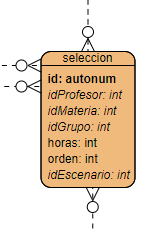

Además de las claves ajenas a las tablas con las que se relaciona (en cursiva en la imagen anterior), cuenta con campos propios: un código autonumérico para identificar cada selección, el número de horas que elige el profesor de la materia seleccionada (todas, salvo que la divida para compartirla con otro profesor/a), y el orden de preferencia de esa materia en su selección, para poder decidir a quién asignar una materia en caso de conflicto entre profesores, por orden de preferencia tanto del profesor como de la materia seleccionada. Por ejemplo, si un profesor que elige en tercer lugar escoge la materia A como su segunda opción, y un profesor que elige en sexto lugar elige la misma materia A como su primera opción, se le asignaría al segundo profesor porque, aunque su turno de elección es posterior, la elegiría como primera opción. En cualquier caso, esto no es un proceso de adjudicación automática. El jefe/a departamento deberá mediar para tener en cuenta las preferencias de cada profesor/a.

La vista principal desde la que gestionar las selecciones es `seleccion.php`. Internamente carga cabecera y pie, como otras vistas, y hace uso del fichero `js/seleccion.js` para algunas funciones que se activarán desde distintos elementos de la página que iremos explicando. 

En el caso de que el usuario accedido sea *admin*, se le muestra un desplegable para que elija el departamento con el que trabajar, y después se cargan los escenarios de dicho departamento en un desplegable posterior. También en esta vista, dependiendo de si el usuario tiene permisos "extra" (usuario "admin" o jefe del departamento en cuestión), se le habilitarán ciertas opciones adicionales que explicaremos a continuación.

Bajo las opciones anteriores (lista de departamentos para "admin" y lista de escenarios para elegir), se muestran varias columnas. 

En el caso de ser administradores o jefes de departamento veremos 3 columnas:

* Primera columna con el listado de profesores del departamento, pudiendo filtrar por especialidad
* Segunda columna con el listado de cursos y materias para elegir (incluyendo materias asignadas por la directiva, como por ejemplo cargos, jefaturas, etc)
* Tercera columna con la selección de materias hecha por el profesor actualmente seleccionado en la primera columna

En el caso de ser profesores "rasos", se verán dos columnas:

* Primera columna (más ancha) con el listado de cursos y materias (excluyendo las que se asignen por parte de la directiva, que no son elegibles por el profesorado)
* Segunda columna con la selección hecha por el profesor

Como ésta es una vista que ofrece muchas opciones y es difícil tener una visión general del funcionamiento, vamos a explicar qué es lo que hace cada una de las funcionalidades que ofrece la página, ahora que ya sabemos la estructura que tiene.

#### 7.2.1. Listado de profesores

La columna izquierda de profesores sólo es visible por los jefes de departamento o por el usuario *admin*. Está englobada dentro de un *div* con *id* "profesoresDesideratas" en la página `seleccion.php`. En primer lugar muestra un conjunto de *radio buttons* con las distintas especialidades asociadas al departamento actual, más una opción extra "Todos". Estos *radio buttons" permiten filtrar el listado de profesores para la especialidad indicada. Cada *radio button* invoca a una función `cambiarEspecialidad` del fichero `js/seleccion.js` que almacena la especialidad elegida y actualiza el div "listaprof" con los profesores que pertenecen a esa especialidad, invocando a la función `listarProfesores`. Esta función hace uso del archivo `ajax/seleccion/listar_profesores.php` para recuperar por AJAX el listado de profesores y cargarlo en dicho *div*. En cada profesor se muestra su nombre y el número de horas lectivas que tiene seleccionadas para el escenario actual. Este número de horas se muestra de un color u otro dependiendo de si se queda corto o excede del número de horas lectivas recomendable.

**Borrar las selecciones de todos los profesores**

En esta misma columna de profesores, en la parte superior, hay un icono que llama a la función `borrarTodasSelecciones` del fichero `js/seleccion.js`. Internamente se accede por AJAX al fichero `ajax/seleccion/borrar_todas_selecciones.php` que elimina todas las selecciones del profesorado para el escenario indicado. Al estar englobada dentro de esta primera columna, sólo es visible por los jefes de departamento o por el usuario *admin*.

**Imprimir la desiderata de todos los profesores**

Junto al icono anterior hay otro icono que llama a la función `imprimirSeleccion` del fichero `js/seleccion.js`. Esta función recibe un booleano indicando si queremos imprimir la selección de un profesor en concreto (*true*) o de todos los implicados en el escenario (*false*), y en este caso se usa con este segundo valor. Lo que se hace es abrir en una ventana aparte el contenido generado por el fichero `pdf_desiderata.php`, pasándole como parámetros el *id* del escenario y el código de la especialidad de los profesores que queremos imprimir (que será *Todos* para imprimir todas las especialidades).

#### 7.2.2. Columna de cursos y materias

La columna de cursos y materias está englobada en un *div* con *id* "cursosDesideratas" (en el caso de jefes de departamento o usuario *admin*) o con *id * "cursosProfesorDesideratas" (en el caso de profesores). La diferencia es simplemente la anchura CSS que se le da a la caja, mayor en el caso de profesores por no tener la columna anterior de listado de profesores.

Internamente muestra el listado de cursos y materias disponibles, usando la función `listarCursos` del fichero `js/seleccion.js`. Esta función llama por AJAX al fichero `ajax/seleccion/listar_cursos.php`, que devuelve un listado de cursos y materias de cada curso, actualizado para el escenario actual. Para cada curso se muestra en forma de acordeón (desplegable vertical) las materias de dicho curso, indicando en cada una cuántos profesores la han elegido. Igual que en el caso anterior, este número se muestra de un color u otro dependiendo de si hay pocos o demasiados profesores eligiendo la materia.

> **NOTA**: el fichero `ajax/seleccion/listar_cursos.php` muestra unos cursos u otros dependiendo de los permisos del usuario que ha accedido. Si es un jefe de departamento o un usuario "admin", muestra todos los cursos y materias asignadas al departamento. Si es un profesor normal, sólo muestra aquellos que él mismo/a puede elegir (y no son asignados directamente por la directiva, como por ejemplo los distintos cargos).

Junto a cada materia hay asociados dos eventos JavaScript (funciones del fichero `js/seleccion.js`).

**Seleccionar una materia**

Esta opción se activa cuando el usuario decide elegir dicha materia haciendo clic en el botón '+' junto a su nombre. Se invoca a la función `seleccionarHorasMateria` del fichero `js/seleccion.js`, pasándole el *id* de la materia y grupo elegidos, la especialidad asignada a la materia (que indica qué profesores deberían impartirla), las horas semanales que tiene y si es divisible entre varios profesores o no. La función comprueba si la materia concuerda con la especialidad del profesor (en caso contrario le pide confirmación para poderla elegir) y abre el formulario modal `modales/horas_seleccion.php`, para que el profesor elija cuántas horas tomar de la materia (en caso de que sea divisible) y enviar su solicitud. Al enviar el formulario se invoca a la función `seleccionarHoras` del fichero `js/seleccion.js`, que se encarga de invocar por AJAX al fichero `ajax/seleccion/insertar_seleccion.php` para añadir la selección de materia para el profesor y escenario actual, y también a `ajax/seleccion/sumar_seleccion.php` para calcular la suma total de horas lectivas que lleva el profesor indicado. Estas dos llamadas afectan a los *divs* "listasel" y "totalsel" del panel derecho, donde se actualizan automáticamente el listado de materias seleccionada por el profesor/a, y el total de horas acumuladas.

**Ver profesorado que ha elegido una materia**

A la derecha del nombre de cada materia aparece un *badge* con un número indicando cuántos profesores la han elegido, indicando también el total de unidades asignadas (cuántos grupos hay para esa materia en el curso y grupo indicado). Este *badge* se muestra de un color u otro dependiendo de si la materia está libre, ocupada, o si hay demasiados profesores. Pero, haciendo clic en el propio *badge*, se invoca a la función `cargarSeleccionesMateria` del fichero `js/seleccion.js` que abre el diálogo modal `modales/selecciones_materia.php` y vuelca en él el contenido del fichero AJAX `ajax/seleccion/cargar_listado_profesores_materia.php`. Simplemente se genera un listado de los profesores que han elegido esa materia para el mismo curso y grupo, en el presente escenario.

#### 7.2.3. La selección del profesor

En la columna derecha se muestra la selección del profesor actual (o del que haya seleccionado en el panel izquierdo de profesores, si está). Se muestra en un *div* llamado *seleccionDesideratas*, que internamente tiene tres secciones preparadas para rellenarse:

* Los datos del profesor en un párrafo llamado *profsel*. Este párrafo se rellena desde la función `seleccionarProfesor` del fichero `js/seleccion.js`, que a su vez se activa de dos formas: o bien eligiendo un profesor del panel izquierdo de profesores (sólo para jefes de departamento y administradores) o bien accediendo a la página como un profesor normal.
* La lista de materias elegida en un *div* llamado *listasel*. Este *div* se actualiza cuando elegimos un profesor del panel izquierdo, o cuando accedemos como profesores normales, o cuando añadimos/borramos materias de la selección del profesor
* El total de horas lectivas elegidas en un *div* llamado *totalsel*. Se actualiza en los mismos casos que el *div* *listasel* anterior.

**Reordenar selección**

Arrastrando y soltando las materias seleccionadas se cambia su orden de prioridad. Esto es relevante en caso de conflicto con otros profesores, porque indica en qué turno eligiría la materia cada uno. Para ello, en el fichero `js/seleccion.js` se define un evento de ordenación sobre los items del *div* *listasel* de forma que, cuando se produzca cualquier actualización, se invoque por AJAX al fichero `ajax/seleccion/ordenar_seleccion.php`. Se le envía en una cadena de texto los códigos de selección implicados, y se le asigna a cada una un orden en la tabla *seleccion*.

**Seleccionar materia**

Dentro del listado de materias del panel derecho podremos seleccionar cualquiera de ellas haciendo clic encima (salvo las que sean asignadas por la directiva). Esto activa la función `seleccionarSeleccion` que marcará de un color diferente a la materia seleccionada.

**Borrar materia seleccionada**

Si seleccionamos cualquier materia del panel derecho de selección y hacemos clic en el icono del cubo de basura, se invoca a la función `borrarSeleccion` del fichero `js/seleccion.js`. Internamente llama por AJAX a `ajax/seleccion/borrar_seleccion.php` para eliminar la selección del escenario actual, y luego a `ajax/seleccion/sumar_seleccion.php` para recalcular el total de horas lectivas del profesor. Se actualizan los *divs* *listasel* y *totalsel* con ambas llamadas.

**Borrar toda la selección del profesor**

Si seleccionamos el siguiente icono (junto a la papelera), borramos todas las materias seleccionadas por el profesor actual (salvo las que le haya asignado la directiva). Para ello hacemos uso de la función `borrarTodaSeleccion` del fichero `js/seleccion.js`, que llama por AJAX a `ajax/seleccion/borrar_toda_seleccion.php` y a `ajax/seleccion/sumar_seleccion.php` para actualizar los *divs* correspondientes, como en el caso anterior.

**Mostrar estadísticas y conflictos**

El siguiente icono del panel derecho (bajo la selección) permite mostrar estadísticas de horas elegidas por las distintas especialidades del departamento, y conflictos existentes en materias (porque no las haya elegido nadie, o porque haya demasiados profesores interesados, por ejemplo). Al hacer clic en el icono se invoca a la función `estadisticas` del fichero `js/seleccion.js`, que simplemente abre una ventana aparte con el fichero `estadisticas.php` de la carpeta principal, indicando el escenario del que mostrar las estadísticas. Este fichero realiza muchas consultas a la base de datos para mostrar la información en tres paneles diferentes:

* *Horas por especialidades*: muestra para cada especialidad asignada al departamento actual el total de horas lectivas elegidas, total de horas de tutoría (comparado con el que le correspondería), total de horas cedidas a otras especialidades y total de horas asumidas de otras especialidades.
* *Conflictos*: muestra, en primer lugar, todas las materias que siguen sin ser escogidas actualmente para el escenario elegido y, después, las materias que tiene elegidas más de un profesor, o donde haya restricciones no satisfechas de profesorado (ver siguiente apartado).
* *Materias con restricciones*: muestra qué materias tienen restricciones en cuanto a número mínimo o máximo de profesores permitido. Esto se dará en materias con desdobles, o con varios grupos en el mismo horario, donde un profesor no pueda coger dos unidades del mismo grupo, por ejemplo.

**Ver ficha de profesor**

La siguiente opción invoca a la función `imprimirSeleccion` que hemos visto antes para el panel de profesores, pero en este caso le pasamos un parámetro *true* para indicar que sólo queremos mostrar la ficha de selección del profesor seleccionado. Internamente se llama a la misma página `pdf_desiderata.php` explicada antes, pero indicándole un *id* de profesor del que sacar la ficha.

**Ver preferencias de profesor**

Similar a la opción anterior, pero invocando a la función `imprimirPreferenciasSeleccion`, que internamente llama a la página `pdf_preferencias.php`, que genera un horario semanal con las preferencias del profesor seleccionado, usando otra plantilla PDF distinta.

**Generar Excel resumen**

El siguiente icono llama a la función `generarExcel` del fichero `js/seleccion.js`, que simplemente carga en otra ventana la página `excel.php`, indicando el escenario actual. Se genera un fichero Excel con diferentes apartados:

* En la parte izquierda se genera una tabla, dividiendo por colores para cada grupo de cada curso. En cada fila se indica el nombre de la materia, el tipo que es (clase normal o tutoría), el curso y grupo al que pertenece, las horas semanales, la especialidad que la debería coger y la que la ha cogido (marcando ésta en rojo si no coincide con la anterior), la abreviatura del profesor que la ha elegido y el departamento al que pertenece.
* En la parte derecha superior aparece una pequeña tabla indicando, para cada especialidad del departamento, cuántas horas ha elegido en total y cuántos profesores corresponderían de esa especialidad.
* Debajo de la tabla anterior aparece otra donde, para cada grupo de cada curso, se indica cuántas horas lectivas se han escogido (para ver si falta alguna hora por cubrir)
* Después aparece un listado de profesores, mostrando el total de horas lectivas elegido por cada uno/a
* A continuación aparece una tabla que establece la correspondencia entre las abreviaturas de los profesores y sus nombres completos.

### 7.3. El "modo rueda"

Desde la sección de escenarios se puede habilitar un "modo rueda" para un escenario en concreto. Esto implica que el profesorado pierde el control en la selección de materias, y es el jefe/a de departamento (o el administrador) quien puede asignar a cada profesor sus materias, en el orden establecido. 

Si el "modo rueda" está habilitado, para cualquier profesor que no sea jefe de departamento o administrador:

* Desaparece el botón junto a cada asignatura para poderla seleccionar
* Desaparecen los botones para borrar su selección
* Se deshabilita la opción de reordenar sus preferencias

### 7.4. El histórico de selecciones

Para consultar las selecciones que ha hecho cada profesor se hace uso de la tabla `seleccion` anterior, cruzándola con las tablas de `escenarios_desideratas`,  `materias`, `cursos`, `grupos` y `profesores` para saber qué materias ha elegido cada profesor de cada grupo en un escenario concreto.

Desde la página principal `historico.php` se elige primero el escenario a consultar de un desplegable (si se entra como *admin*, también se debe elegir previamente el departamento sobre el que trabajar). Esto invoca a una función del fichero `js/historico.js` que llama al fichero `ajax/escenarios/cargar_historico.php` enviándole el *id* del escenario a consultar. Desde ese fichero se obtienen todos los profesores involucrados en el escenario, ordenados por orden de elección. Para cada uno, se hace una consulta compleja que cruza todas las otras tablas (selección, profesores, grupos, cursos y materias) para obtener la selección de ese profesor en el escenario indicado para las diferentes materias. Finalmente se muestra en una tabla para cada profesor su selección.

Para este propósito, la página hace uso de estos otros ficheros:

* `includes/seleccion_departamento.php`: en el caso de acceder como usuario *admin*, este *include* permite elegir el departamento con el que trabajar, como paso previo a la gestión del histórico de escenarios para ese departamento.
* `js/historico.js`: funciones JavaScript para cargar el histórico del escenario indicado.

Este fichero JavaScript a su vez hace uso del fichero `ajax/escenarios/cargar_historico.php`, que recibe un *id* de escenario y devuelve un listado con todos los profesores que eligieron en él, junto con el listado de materias que eligió cada uno.

## 8. Programaciones didácticas

La gestión de las programaciones didácticas en la aplicación comprende diferentes aspectos:

* Definir los apartados que conforman una programación didáctica, para diferentes tipos de cursos (ESO, Bachillerato, Ciclos Formativos...)
* Definir contenidos por defecto para ciertos apartados de las programaciones. En caso de que no se concrete dicho apartado en una programación en especial, se pondrá este apartado por defecto. Esto puede aplicarse a secciones como la *Contextualización*, *Atención a alumnado con necesidades específicas*, etc.
* Definir los contenidos específicos de cada apartado para cada programación didáctica
* Establecer el seguimiento de la programación al final de cada evaluación
* Definir los resultados de aprendizaje asociados a las distintas materias
* ...

### 8.1. Apartados de la programación

En la tabla `apartados_programaciones` se definen los apartados que forman parte de una programación didáctica.

   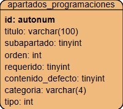

Explicamos a continuación los diferentes campos de la tabla:

* *titulo*: es el título del apartado
* *subtitulo*: es un booleano que indica si es un subapartado (1) o apartado principal (0)
* *orden*: es el orden que tiene ese apartado respecto al resto
* *requerido*: booleano que indica si ese apartado es obligatorio rellenarlo en las programaciones o no
* *contenido_defecto*: indica si ese apartado es susceptible de tener un contenido por defecto, en el caso de que no se rellene para algunas programaciones concretas
* *categoria*: un campo similar al campo *categoria* de la tabla de *cursos*, para indicar en qué categoría de cursos se añade el apartado: ESO, Bachillerato, FP...

La gestión de estos apartados se lleva a cabo desde la página `programaciones_apartados.php`. Carga cabecera y pie comunes al resto de páginas, e incluye otras dos páginas:

* `modales/programaciones_apartados.php`: formulario modal para insertar/editar apartados de la programación
* `js/programaciones_apartados.js`: con funciones AJAX para cargar, insertar, borrar apartados.

El fichero JavaScript hace uso de los siguientes ficheros, invocados por AJAX:

* `ajax/programaciones_apartados/cargar_apartados.php`: devuelve un listado HTML con los apartados disponibles para las programaciones, en el orden establecido
* `ajax/programaciones_apartados/cargar_apartado.php`: devuelve los datos del apartado indicado, en formato JSON, para volcarlos en el formulario modal
* `ajax/programaciones_apartados/insertar_apartado.php`: recibe los datos del apartado a insertar o actualizar
* `ajax/programaciones_apartados/borrar_apartado.php`: elimina el apartado correspondiente de la base de datos y las referencias que pudiera tener en la tabla de contenidos de la programación.
* `ajax/programaciones_apartados/ordenar_apartados.php`: reordena los apartados de la programación según el nuevo orden recibido.

### 8.2. Contenidos por defecto de algunos apartados

La gestión de contenidos por defecto de algunos apartados de las programaciones se ubica en la tabla `contenidos_defecto_programaciones`, que se relaciona con la tabla anterior de apartados y con la de departamentos, estableciendo así un contenido común para cada apartado de la programación didáctica (susceptible de ello), para cada departamento.

   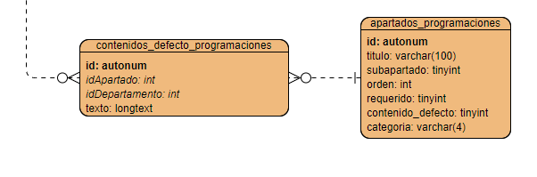

La gestión se centraliza en la página `programaciones_contenidos_defecto.php`, que carga cabecera y pie, y además se apoya en el fichero `js/programaciones_contenidos_defecto.js` para hacer algunas llamadas AJAX para actualizar los contenidos.

Al ser una tarea que puede hacer tanto el jefe del departamento en cuestión como el usuario *admin*, para estos últimos muestra al inicio de la página un desplegable para elegir el departamento, igual que se hace en otras secciones de la web, como las de actas de departamentos, por ejemplo.

Después se muestra otro desplegable con los apartados de la programación que pueden tener contenido por defecto (tienen a 1 el respectivo campo booleano de la tabla *apartados_programaciones*). Al elegir un elemento de este desplegable se muestra su contenido actual en un área de texto TinyMCE (como la de las actas de departamento), para poderlo editar y guardar.

Internamente, desde el fichero JavaScript se hace uso de dos páginas a través de AJAX:

* `ajax/programaciones_contenidos_defecto/cargar_contenido_defecto_programacion.php` para cargar el contenido por defecto indicado en el área de texto.
* `ajax/programaciones_contenidos_defecto/insertar_contenido_defecto_programacion.php` para insertar o modificar el contenido por defecto indicado.

### 8.3. Resultados de aprendizaje y criterios de evaluación

Los resultados de aprendizaje de cada materia se gestionan en la tabla `resultados_aprendizaje`, que vincula cada resultado con una materia, asignándole un orden. También se puede indicar el porcentaje de docencia que corre a cargo de la empresa (en el caso de materias con formación dual, en caso contrario se puede dejar a 0). Además, esta tabla está relacionada con lo criterios de evaluación asociados a cada RA. Cada criterio tiene un código alfanumérico y un texto explicativo.

   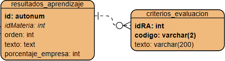

La gestión se realiza desde la vista `resultados_aprendizaje.php`. En el caso de ser usuarios administradores, primero se deberá elegir el departamento con el que trabajar, y con eso se hace un listado con las materias de ese departamento. En el caso de ser jefes de departamento, también veremos todas las materias del departamento, y en el caso de ser profesores, sólo las que impartimos. Además, el fichero PHP hace uso de estos otros ficheros:

* `modales/resultados_aprendizaje.php`: formulario modal para insertar/editar resultados de aprendizaje
* `modales/criterios_evaluacion.php`: formulario para gestionar los CE asociados al RA en cuestión.
* `js/resultados_aprendizaje.js`: fichero JavaScript con funciones para cargar/borrar/insertar resultados de aprendizaje mediante llamadas AJAX.

El fichero JavaScript se apoya en los siguientes ficheros en sus llamadas AJAX:

* `ajax/resultados_aprendizaje/cargar_resultados_aprendizaje.php`: devuelve un listado HTML con los resultados de aprendizaje de la materia seleccionada. Para cada uno se indica el número de orden, el texto y el porcentaje asignado a la empresa para docencia. También se pueden editar o borrar con los botones laterales de cada apartado.
* `ajax/resultados_aprendizaje/cargar_resultado_aprendizaje.php`: devuelve los datos de un resultado de aprendizaje concreto en formato JSON, para cargarlos en el formulario modal.
* `ajax/resultados_aprendizaje/insertar_resultado_aprendizaje.php`: recibe los datos de un resultado de aprendizaje para insertarlo o modificarlo
* `ajax/resultados_aprendizaje/borrar_resultado_aprendizaje.php`: elimina el resultado de aprendizaje indicado.
* `ajax/resultados_aprendizaje/cargar_criterios_evaluacion.php`: carga el modal de criterios con los criterios rellenos para el RA seleccionado. Cada criterio se puede editar/borrar, y además se pueden añadir nuevos.
* `ajax/resultados_aprendizaje/borrar_criterio_evaluacion.php`: elimina el CE indicado (identificado por el id de su RA y el código de CE).
* `ajax/resultados_aprendizaje/actualizar_criterio_evaluacion.php`: actualiza los datos (código y/o texto) del CE indicado.
* `ajax/resultados_aprendizaje/insertar_criterio_evaluacion.php`: inserta un nuevo CE para el RA seleccionado.

Desde `cargar_resultados_aprendizaje.php` se carga también un pequeño formulario para actualizar las horas asignadas a la empresa para la materia elegida. Este formulario se activa desde una función en el fichero JavaScript que llama a `ajax/materias/actualizar_horas_empresa.php` para hacer esa actualización.

### 8.4. Competencias para ciclos formativos

Para los ciclos formativos se recogen las competencias profesionales, para la empleabilidad o de cualquier otro tpio en la tabla `competencias_ciclos`, vinculada con la de ciclos a través del *id* del ciclo al que pertenece la competencia:

   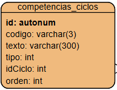

La gestión se realiza desde la vista `competencias_ciclos.php`, que hace uso de los ficheros `modales/competencias_ciclos.php` para el formulario modal para insertar/editar competencias, y `js/competencias_ciclos.js` para las funciones AJAX para cargar/borrar/insertar competencias.

El fichero JavaScript se apoya en los siguientes ficheros en sus llamadas AJAX:

* `ajax/competencias_ciclos/cargar_competencias.php`: devuelve un listado HTML con las competencias del ciclo indicado, ordenadas, junto con botones para editar o borrar cada una.
* `ajax/competencias_ciclos/cargar_competencia.php`: devuelve los datos de una competencia determinada en formato JSON, para cargarlos en el formulario modal.
* `ajax/competencias_ciclos/insertar_competencia.php`: recibe los datos de una competencia para insertarla o modificarla
* `ajax/competencias_ciclos/borrar_competencia.php`: elimina la competencia indicada.
* `ajax/competencias_ciclos/ordenar_competencias.php`: recibe los id de las competencias en el orden deseado y actualiza el campo *orden* de cada una en la base de datos.

### 8.5. Cualificaciones profesionales y unidades de competencia

También para ciclos formativos se recogen las cualificaciones profesionales y las unidades de competencia asociadas. Dado que una UC puede asociarse a distintas cualificaciones y a distintos ciclos, la estructura de tablas y relaciones queda así.

   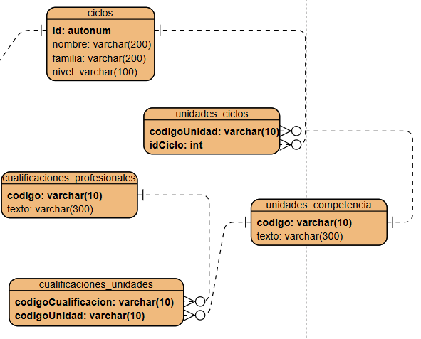

Cada cualificación se relaciona con varias UC, y cada UC con varios ciclos. Todo esto se gestiona desde la vista `cualificaciones_uc.php`, que internamente se apoya en `js/cualificaciones_uc.js` para las llamadas AJAX y en distintos formularios modales:

* `modales/cualificaciones.php` para alta/edición de los datos básicos de cada cualificación profesional.
* `modales/unidades_competencia.php` para alta/edición de los datos básicos de cada UC
* `modales/cualificaciones_unidades` para asociar distintas UC a una cualificación seleccionada

Además, en la carpeta `ajax/cualificaciones_uc` disponemos de distintos ficheros PHP que se invocan por AJAX desde el fichero JavaScript anterior, para gestionar bien cualificaciones, bien UC:

* `cargar_cualificaciones.php`: muestra el listado de cualificaciones profesionales ordenado por código, con opciones para borrar/editar cada una, y también para asociarle distintas UC.
* `cargar_unidades.php`: muestra el listado de UC ordenadas por código, con opciones para borrar/editar
* `cargar_cualificacion.php`: muestra los datos básicos de una cualificación concreta en el formulario para su edición.
* `cargar_unidad.php`: muestra los datos básicos de una unidad concreta en el formulario para su edición.
* `insertar_cualificacion.php`: inserta/edita los datos de la cualificación enviada
* `insertar_unidad.php`: inserta/edita los datos de la UC enviada
* `borrar_cualificacion.php`: elimina los datos de la cualificación indicada (siempre que no tenga UC asociadas)
* `borrar_unidad.php`: elimina la UC indicada (y su asociación con los ciclos que tenga)
* `cargar_asociaciones_cualificacion.php`: rellena el contenido del modal `cualificaciones_unidades` con los datos de la cualificación indicada, las UC que tiene actualmente asociadas, y un desplegable para poderle añadir más.
* `borrar_asociacion.php`: elimina la asociación entre la cualificación y la UC indicadas
* `nueva_asociacion.php`: añade una nueva asociación entre la cualificación y la UC indicadas

Además, en lo que respecta a la asociación de unidades de competencia con ciclos formativos (tabla `unidades_ciclos`), se tiene el formulario modal `modales/unidades_ciclos.php` y se ha añadido la funcionalidad correspondiente en `js/ciclos.js` para hacer las llamadas AJAX a estos ficheros:

* `ajax/ciclos/cargar_asociaciones_unidades.php`: carga en el modal las asociaciones de unidades con el ciclo seleccionado.
* `ajax/ciclos/borrar_asociacion.php`: elimina la asociación indicada entre unidad y ciclo
* `ajax/ciclos/nueva_asociacion.php`: añade una asociación entre unidad y ciclo indicados

### 8.6. Contenidos de las programaciones

Los contenidos de las programaciones se almacenan en la tabla `contenidos_programaciones`:

   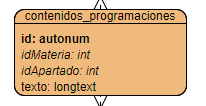

Como vemos, se relaciona, por un lado, con la materia de la que forma parte, y por otro, con el apartado en concreto que se está editando. 

Internamente hace uso del fichero `js/programaciones.js`, que dispone de funciones para seleccionar la materia, el apartado en cuestión, guardar los cambios, etc. Este fichero, a su vez, emplea llamadas AJAX a otros ficheros:

* `ajax/programaciones/cargar_contenido_programacion.php`: devuelve el texto almacenado para una materia y apartado específicos
* `ajax/programaciones/insertar_contenido_programacion.php`: inserta o modifica el texto almacenado para una materia y apartado específicos.
* `ajax/programaciones/importar_programacion.php`: importa todo el contenido de una programación origen en otra destino (borrando el contenido previo de esta última).

La página, como otras muchas, muestra un desplegable para elegir departamento en el caso de que accedamos como administradores. Después se debe elegir la materia y el apartado a editar, y se cargará un área de texto TinyMCE (como la que hay para las actas de departamentos, o los contenidos por defecto de las programaciones), con el contenido actual de ese apartado para esa materia. Pulsando el botón de *Guardar cambios* se envía el formulario con los cambios a guardar.

Además, la vista permite hacer otras tres operaciones más, ayudándose de las funciones correspondientes del fichero JavaScript:

* Obtener una vista previa de la programación de la materia escogida (formato HTML). En esta vista previa se marcan en rojo aquellos apartados obligatorios que no se han rellenado
* Generar un fichero PDF con la programación de la materia escogida
* Generar un fichero PDF con el apartado escogido
* Importar el contenido de otra programación en la actualmente seleccionada (sólo para administradores y jefes de departamento)

### 8.7. Seguimiento de las programaciones

El seguimiento de las programaciones didácticas se almacena en dos tablas de la base de datos: `seguimiento_programaciones` para almacenar el seguimiento por materia, curso y evaluación, y `seguimiento_programaciones_departamento` para almacenar un seguimiento general por departamento, curso y evaluación.

   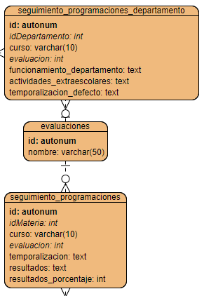

Como vemos, en la tabla de `seguimiento_programaciones` almacenamos la materia, curso académico y evaluación, junto con información textual de la temporalización de contenidos y los resultados obtenidos. También se almacena el porcentaje numérico de aprobados en la materia. Por su parte, en la tabla `seguimiento_programaciones_departamento` se almacena el departamento, curso y evaluación, junto con información textual del funcionamiento del departamento durante esa evaluación, las actividades extraescolares y la temporalización general de los contenidos (en el caso de que no se especifique para alguna materia en concreto). Además, estas dos tablas conectan con una tabla `evaluaciones` donde están introducidas a mano las evaluaciones a considerar.

Todo el seguimiento se centraliza en la vista `programaciones_seguimiento.php`, que a su vez se apoya en `js/programaciones_seguimiento.js` para comunicarse por AJAX con distintas opciones:

* `ajax/programaciones_seguimiento/cargar_datos_seguimiento.php`: devuelve en formato JSON los datos de seguimiento para un curso, materia y evaluación indicados. Internamente, según los parámetros que recibe, decide si cargar los del curso y evaluación actuales, o los de la evaluación o curso anterior, según lo que se haya especificado al llamarle.
* `ajax/programaciones_seguimiento/cargar_datos_seguimiento_comun.php`: devuelve en formato JSON los datos del seguimiento común a un departamento, para un curso y evaluación indicados. Internamente, según los parámetros que recibe, decide si cargar los del curso y evaluación actuales, o los de la evaluación o curso anterior, según lo que se haya especificado al llamarle.
* `ajax/programaciones_seguimiento/insertar_seguimiento_programacion.php`: recibe datos de seguimiento de una materia, curso y evaluación y los inserta/actualiza en la base de datos
* `ajax/programaciones_seguimiento/insertar_seguimiento_comun_programacion.php`: recibe datos de seguimiento general de un departamento, curso y evaluación y los inserta/actualiza en la base de datos.

La página `programaciones_seguimiento.php` divide su código en 3 grandes bloques:

* Primero muestra varios desplegables para elegir la materia, el curso y la evaluación. Además, dependiendo de si somos administradores, jefes de departamento o profesores tendremos habilitados unos u otros desplegables (en el caso de administradores tendremos que elegir también el departamento con que trabajar)
* Después muestra el formulario de edición del seguimiento para la materia, curso y evaluación indicados. Aquí podremos rellenar la temporalización, resultados y porcentaje de aprobados
* Finalmente (en el caso de aministradores o jefes de departamento) hay una tercera sección para editar el seguimiento general del departamento (funcionamiento del departamento, actividades extraescolares y temporalización por defecto a incluir en otros seguimientos particulares, si no se ha especificado ninguna).

### 8.8. Temas/Unidades de las programaciones

La programación didáctica de cada materia tiene asociados una serie de temas o unidades, que se almacenan en la tabla `temas` y están vinculados a cada materia por el *idMateria* correspondiente.

   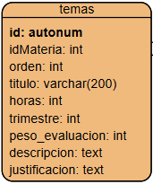

> **NOTA**: la tabla contiene algunos campos más que no aparecen en la imagen, pero que son de tipo "text" con información larga, como los últimos que se ven.

La gestión de estas unidades se activa mediante un botón *Unidades* en la vista *programaciones.php*, que a su vez carga la vista `temas.php` en una nueva pestaña. Esta nueva vista está ayudada por los formularios modales `modales/nuevo_tema.php` (para crear un nuevo tema con sus datos básicos de número y título), y `modales/editar_tema.php` (un formulario mucho mayor para editar cada apartado específico de los temas). Además, el fichero `js/temas.js` proporciona la lógica JavaScript y la conexión con los ficheros AJAX que hacen la carga asíncrona:

* `ajax/temas/cargar_temas.php`: carga el listado de temas con botones para borrar o editar cada uno
* `ajax/temas/cargar_tema.php`: carga en el formulario de edición los datos del tema seleccionado para poderlos modificar.
* `ajax/temas/borrar_tema.php`: elimina el tema de la tabla
* `ajax/temas/insertar_tema.php`: inserta un nuevo tema con datos básicos (número y título)
* `ajax/temas/actualizar_tema.php`: actualiza todos los datos de un tema en la tabla con los que recibe del formulario de edición. Actualiza tanto los datos de la propia tabla `temas` como de las tablas relacionadas (`criterios_temas` para los criterios de evaluación asociados al tema y `competencias_tema` para las competencias asociadas).
* `ajax/temas/repetir_evaluacion_temas.php`: propaga el valor de un campo "evaluacion" a todos los temas de la materia.
* `ajax/temas/cargar_checkboxes.php`: devuelve en formato JSON la relación del tema con los criterios de evaluación y las competencias (tablas `criterios_temas` y `competencias_temas`), para que se puedan actualizar los checkboxes del formulario modal de edición de temas.

#### 8.8.1. Contenidos por defecto de las unidades

Se tiene la tabla `contenidos_defecto_temas` para recoger los contenidos por defecto que pueden tener ciertos apartados de los temas/unidades. Se asocian a cada departamento, ya que cada uno puede tener sus propios contenidos para las unidades de sus materias.

   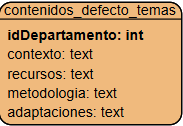

Esto se gestiona desde la vista `temas_contenidos_defecto.php`, que carga en el formulario el contenido que haya en cada campo de texot, y se apoya en el fichero `js/temas_contenidos_defecto.js` para invocar por AJAX al fichero `ajax/temas_contenidos_defecto/insertar_contenido_defecto_tema.php` para insertar/actualizar dichos contenidos.

### 8.9. Programaciones de aula

La programación de aula de cada profesor para cada materia y grupo se almacena en la tabla `programaciones_aula_temas`.

   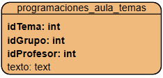

La clave primaria la forman el *id* del tema (clave ajena a la tabla *temas*, que a su vez contiene la materia de que se trata), el *id* del grupo y del profesor. Para cada tema de cada grupo de cada profesor se establece un campo de texto para indicar la programación de aula de ese tema.

La gestión de la tabla se realiza desde la vista `programaciones_aula.php`, apoyada por el fichero `js/programaciones_aula.js` para las llamadas AJAX a la carpeta correspondiente:

* `ajax/programaciones_aula/cargar_grupos.php`: carga los grupos en los que imparte un profesor para una materia dada
* `ajax/programaciones_aula/cargar_temas.php`: carga los temas de una materia dada
* `ajax/programaciones_aula/cargar_contenido_programacion.php`: carga en el cuadro de texto el texto asociado a un tema, grupo y profesor indicados.
* `ajax/programaciones_aula/insertar_contenido_programacion.php`: añade o modifica el contenido de una programación de aula para un tema, grupo y profesor indicados.

## 9. Proyectos curriculares de ciclo (PCCF)

Para la gestión de los PCCF se añaden las tablas `apartados_pccf`, `contenidos_defecto_pccf` y `contenidos_pccf`, con estructura paralela a las correspondientes tablas de las programaciones didácticas (`apartados_programaciones`, `contenidos_defecto_programaciones` y `contenidos_programaciones`) vistas antes.

   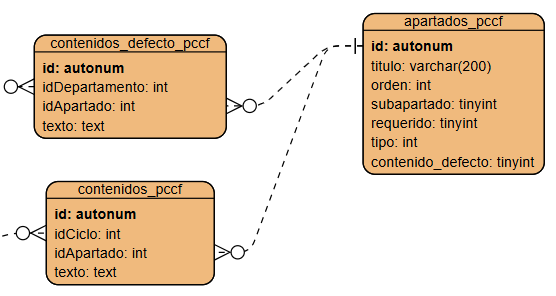

### 9.1. Apartados del PCCF

La gestión de los apartados se realiza desde la vista `pccf_apartados.php`, que se vale de `js/pccf_apartados.js` y del formulario modal `modales/pccf_apartados.php` para funcionar, invocando a las funciones AJAX de la carpeta `ajax/pccf_apartados`.

El funcionamiento es similar a los mismos ficheros vistos para los apartados de las programaciones en una sección anterior.

### 9.2. Contenidos por defecto del PCCF

Para gestionar el contenido por defecto de ciertos apartados del PCCF se tiene la vista `pccf_contenidos_defecto.php`, que se apoya en `js/pccf_contenidos_defecto.js` y en los ficheros PHP que se invocan por AJAX en `ajax/pccf_contenidos_defecto`. El funcionamiento es muy similar a los contenidos por defecto de las programaciones que se ha explicado en una sección anterior.

### 9.3. Contenidos del PCCF

Los contenidos específicos de cada ciclo se gestionan desde la vista `pccf.php`, apoyada por `js/pccf.js` y los ficheros AJAX contenidos en `ajax/pccf`. La dinámica es muy similar a los contenidos de las programaciones didácticas, con la salvedad de que aquí, en lugar de elegir una materia y un apartado, se elige un ciclo y un apartado a editar para ese ciclo.

## Miscelánea

Acceso a diagrama ER temporal. Se tiene la versión antigua (1) y la nueva (2). En la versión antigua aparecen en azul ideas de nuevas tablas que no se llegaron a añadir en esa versión.

https://online.visual-paradigm.com/w/hasnstaz/diagrams/#diagram:workspace=hasnstaz&proj=0&id=10&type=ERDiagram